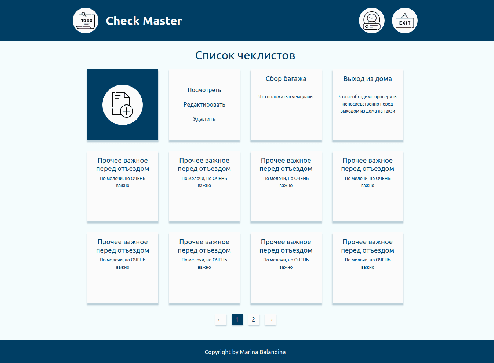
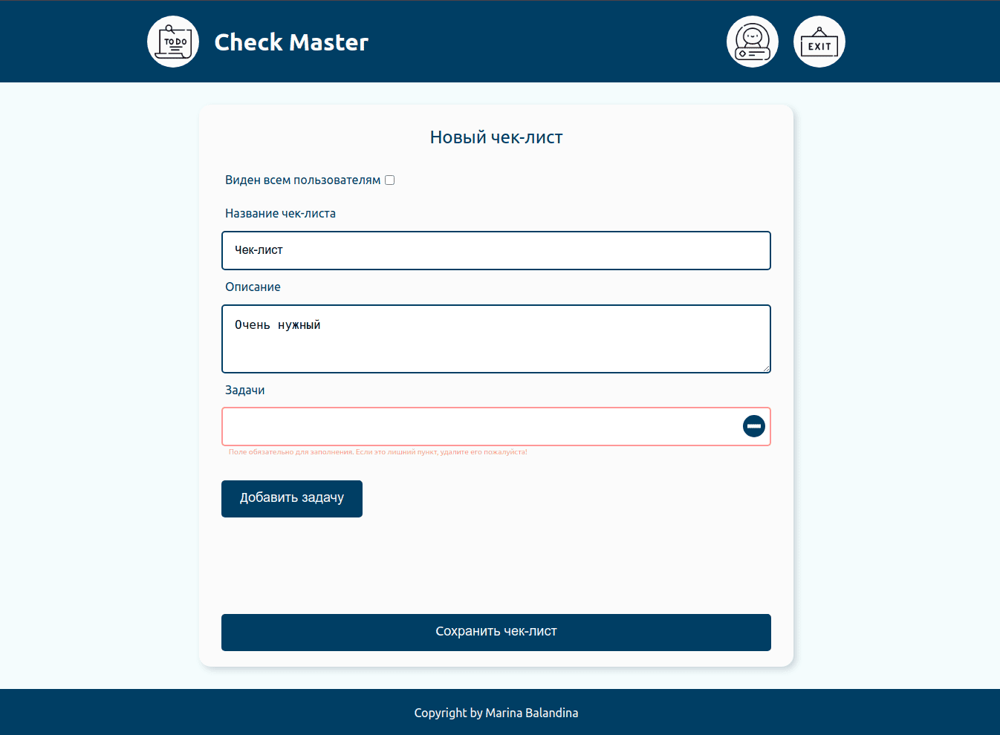
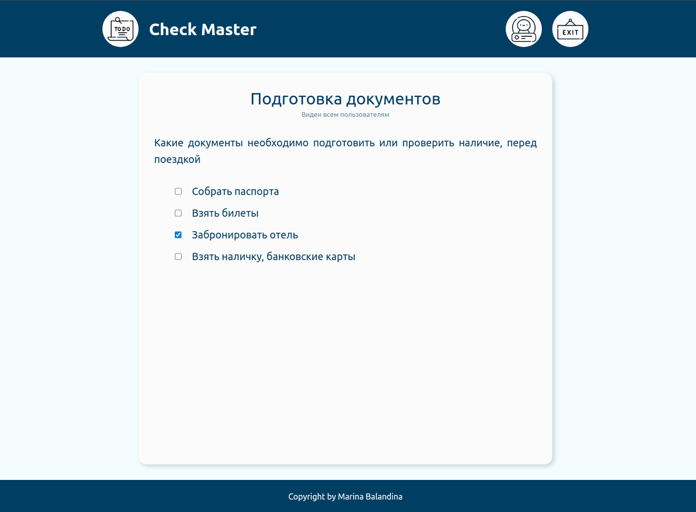
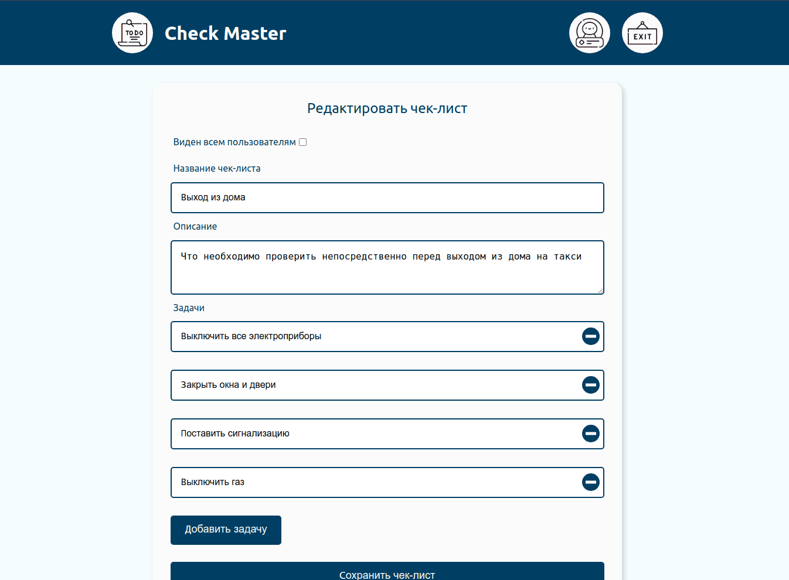

# 📋 Check Master

Приложение для создания и управления чек-листами с возможностью публикации.

## ✨ Основные функции
- ✅ Создание/редактирование чек-листов
- 🔒 Публичные и приватные списки
- 📝 Динамическое добавление пунктов
- 🔄 Отметка выполненных задач

## 🛠 Технологии
- **Frontend**: React 19 + Vite
- **State Management**: Redux Toolkit + Immer
- **Forms**: Formik + Yup
- **Routing**: React Router
- **Стили**: Styled Components
- **Деплой**: GitHub Pages

## 🚀 Запуск
1. Установите зависимости:

```npm install```

2. Запустите dev-сервер:

```npm run dev```

### Для production-сборки:

```npm run build```

## 📸 Скриншоты

| Описание | Скриншот |
|----------|----------|
| **Главный экран** |  |
| **Создание нового чек-листа** |  |
| **Просмотр чек-листа** |  |
| **Редактирование чек-листа** |  |

## ✨ Планы по доработке

- [ ] Добавить кнопку "Назад" в навигацию
- [ ] Реализовать localStorage для оффлайн-работы
- [ ] Фильтрация по типу чек-листов
- [ ] Визуальные улучшения:
  - Кастомные чекбоксы
  - Favicon
  - Микроанимации
- [ ] Улучшение доступности:
  - Правильные `label` для инпутов
  - Курсор pointer для кликабельных элементов

## 📌 Планы по развитию

- Добавить авторизацию и синхронизацию между устройствами
- Адаптация интерфейса под смартфоны и планшеты
